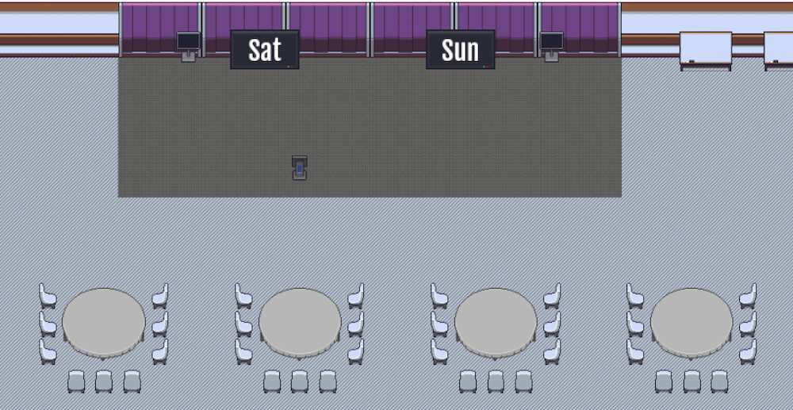

While the MathsJam Gathering takes place primarily in-person, there will be an online option for those who wish to join remotely. We're hoping to make as much of the conference accessible remotely as possible. The entire event is run by volunteers, and while we'll do our best to make sure the remote experience is good, we may experience technical issues which impact on this experience.

## Interactive Online Space

The interactive part of the event will take place in the [Virtual Yarnfield gather.town space](https://app.gather.town/app/MTCdhLpepRbaogJV/virtual-yarnfield). Gather allows you to walk around with the arrow keys and talk to others who are nearby, and we've recreated the real venue fairly accurately. For the week of the event itself, this space will be locked using a password, which will be emailed to registered attendees. You can meet other remote attendees, and chat to them between talks.

While Gather doesn't have native subtitles, there are [details on the Gather website of how to set up live captioning using Google Chrome](https://support.gather.town/hc/en-us/articles/16864885488148-Accessibility-Best-Practices-for-Inclusive-Space-Design#h_01HFW4JZD04JGWS05D8PN9XXVZ).

For more information about using Gather, there are pages on their website about [getting started](https://support.gather.town/hc/en-us/categories/14871434949908-Getting-Started), and [Gather support for mobile devices](https://support.gather.town/hc/en-us/articles/17580563233684-Gather-Mobile-App).

We'll have a dedicated team member onsite to serve as a liaison with remote attendees, and their avatar will be present in the Gather.town space throughout the event sessions. If you have any problems - including with audio or video on the stream - or need help using the space, you can find the avatar and ask them anything you need, or email gathering@mathsjam.com.

## Talks and Activities

For the talk sessions, we’ll be streaming these live from the room through a YouTube feed, the link to which will be shared with registered attendees only. The livestream will be available with live transcribed subtitles, and the recordings will remain available (on the same links) to watch back for a short while afterwards.

It will be possible for remote attendees to give talks and to join in with the Q&A after each session. Giving talks will involve joining a Zoom call - remote speakers will be able to share slides, and will be seen in the room and on the livestream.

After each session of talks, there’ll be a 30-minute break. We’ll be directing the speakers to answer questions at the front of the stage for the first 10 minutes of this break, then for the next 10 minutes they’ll head to a special dedicated remote Q&A room. If you have any questions - or just want to chat to the speakers - please post a chat message in Gather.town to our remote avatar, indicating who you’d like to speak to, and we can make sure that speaker comes to the remote room.

As well as the talks, we have a range of [other activities]({{site.url}}/gathering/uk/whats-on/activities), including the MathsJam Jam and Competition Competition, both of which you will be able to participate in remotely. We will also have a virtual analogue of the [Saturday Night Tables]({{site.url}}/gathering/uk/whats-on/saturday-night-tables) (where possible), and the 'Tables at the Back of the Room'.
