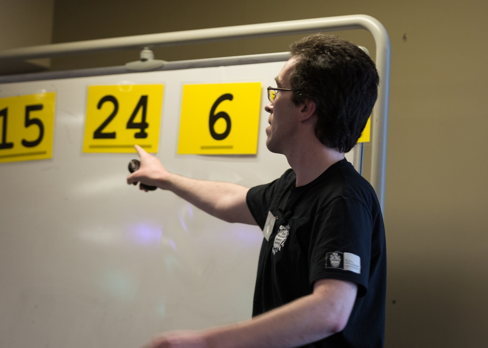
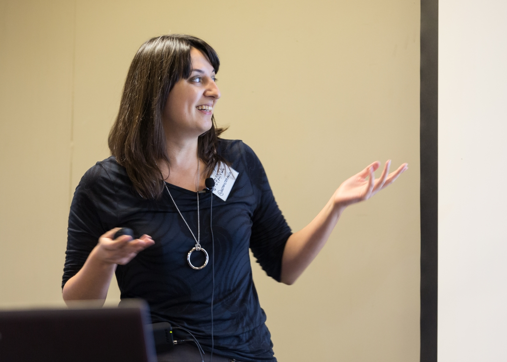

## Schedule of talks
On Saturday afternoon and Sunday morning we have a schedule of five-minute talks. Past talks have included everything from people sharing a mathematical phone game they enjoy, to the ways they made their wedding more mathematical, as well as puzzles, weird mathematical concepts and observations of real-world things containing interesting maths.

All talk sessions are livestreamed to remote attendees, and the breaks between sessions include opportunities for both in-person and remote attendees to talk to the speakers from the previous session.

You can see a [video of a talk from 2023](https://youtu.be/MwRbr-MjwII?feature=shared).

Provisional timings are as follows (note that these are unconfirmed and subject to change):

**Saturday**

- 14:00-14:40 Session 1a
- 15:10-15:50 Session 1b
- 16:20-17:00 Session 1c
- 17:30-18:10 Session 1d

**Sunday**

- 08:45-9:30 Session 2a
- 10:00-10:45 Session 2b
- 11:15-12:00 Session 2c
- 12:30-12:50 Session 2d

## Giving a talk
You can give a talk to show us something you think is interesting, or cool, or weird, or odd. We're not looking for Earth-shattering maths, nor new discoveries, nor anything exceptionally deep or meaningful. We're looking for things that you think are neat, cool, weird, surprising, or that simply intrigue you.

Full information on how to submit a talk will be given when you buy your ticket, but the following might be useful to know:

- Talk submissions are welcome from both in-person and remote attendees.
- Talks are strictly limited to five minutes.
- Think of your five minutes as an invitation for people to come and chat with you.
- A laptop will be made available for presenting, and we will have the capacity to show Powerpoint, Keynote, PDF and online slides, as well as display websites in a browser.
- If you're using slides, you will need to send them in advance.
- There will also be a visualiser for speakers to use.

